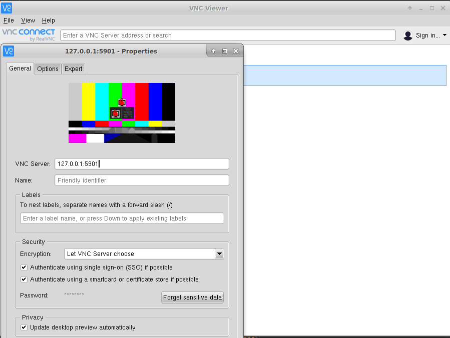
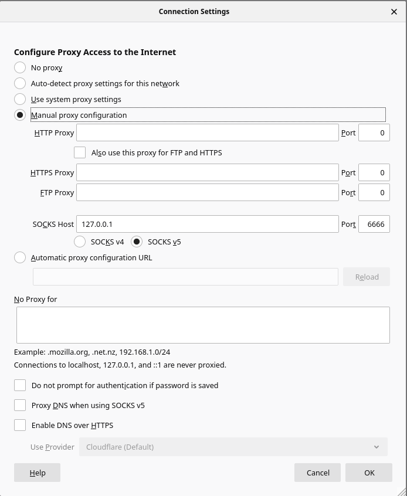

## Reverse tunnelling usage

### Usage Context
On a remote work context one solution is to use teamViewer but if you are *NIX user, one other solution is to implement
a couple of tools / script to access your Office computer in more usable / convenient way especially if your office computer 
is behind a NAT or a firewall.

Basically it consists of using reverse tunnelling  technique and open a ssh connection from your office computer to your home 
computer and redirect some useful protocol throw this ssh connection 

### Prerequisites
- Ubuntu > 18 in the 2 sides
- Your Home router must be accessible and should have port-forwarding capabilities
- Optionally have a no-ip account if your router can deal with it, a ngrok account can do the job to have a fix dress for your home computer

### Steps
#### In the home computer side
1. Configure the port forwarding in the home router [Here an exemple](https://www.cyberpratibha.com/blog/ssh-port-forwarding-in-router/)
2. (Optional) configure a no-ip account in your router if its available
3. (Optional) you can ignore steps 11 and 12 by using [ngrok](https://ngrok.com/) account directly in your home computers
4. Install a nvcClient [RealVnc viewr](https://www.realvnc.com/en/connect/download/viewer/)

#### In the office computer side
1. Install x11vnc vnc server.
2. set the x11vnc password `x11vnc -storepasswd`.
3. stop the x11vnc `ps aux | grep '[u]sr.*bin/x11vnc' | awk {'print $2'} | xargs kill -9`.
4. Create /lib/systemd/system/x11vnc.service and paste the x11vnc.service file content.
5. `sudo systemctl daemon-reload`.
6. `sudo service x11vnc start`.
7. Remove the default gnome-screensaver `sudo apt remove gnome-screensaver`.
8. Install the xscreensaver : `sudo apt-get install xscreensaver`.
9. Make it default lock screen [here a tutorial](https://www.linuxbabe.com/ubuntu/install-autostart-xscreensaver-ubuntu-18-04-19-04).
10. Make it  possible to ssh your home computer without a password  [here a tutorial](https://www.thegeekstuff.com/2008/11/3-steps-to-perform-ssh-login-without-password-using-ssh-keygen-ssh-copy-id/).
11. Copy the *.sh files to ~/.ssh `cp *.sh ~/.ssh/`.
12. Edit the ssh_tunelling.sh in your convenience.
13. configure the cron jobs :

    `*/5 8-18 * * 1-6 ~/.ssh/ssh_tunnel.sh >> /var/log/tunelingssh.log 2>&1
    */5 8-18 * * 1-6 ~/.ssh/ssh_localProxy.sh >> /var/log/localproxyssh.log 2>&1`
    
    Here we execute the .sh scripts every 5 min between 8AM and 6pm from Monday to Saturday.

### Usage
The .sh scripts should be already launched before trying to connect back to the office computer

#### _Remote Desktop_
On the home computer open the vncViewer and add the address server as following : `127.0.0.1:5901`, you may have a field for the password of the vncServer

#### _SSH back to the office computer_
`ssh localhost -p 4022`

#### _Socks Usage_
I'm using fireFox to browse to office computer installed web sites or to go to web application that only accessible from the  office computer
- Got to preferences > Network Settings > Settings
- Select 'Manual proxy configuration'
- In the 'SOCKS Host' field:127.0.0.1 
- In the 'Port' field : 6666
- Select the SOCKS v5 option 

### Security Note
As we use the SSH connection we assume that this technique can be safe, due to the nature of ssh encrypted and secured behavior.

In addition, by configuring the cron jobs to work only on open office time, that's means the ssh connection is under the user control.

Adding a secure layer with a vncSever password can be useful, also, don't forgot to lock the office computer session via Vnc, once you finish your task  

### References
- xscreensaver : [screen saver installation](https://www.linuxbabe.com/ubuntu/install-autostart-xscreensaver-ubuntu-18-04-19-04)
- x11vnc : [x11vncserver installation](https://c-nergy.be/blog/?p=12220)
- ssh : [SSH tunnelling](https://www.ssh.com/ssh/tunneling/example)